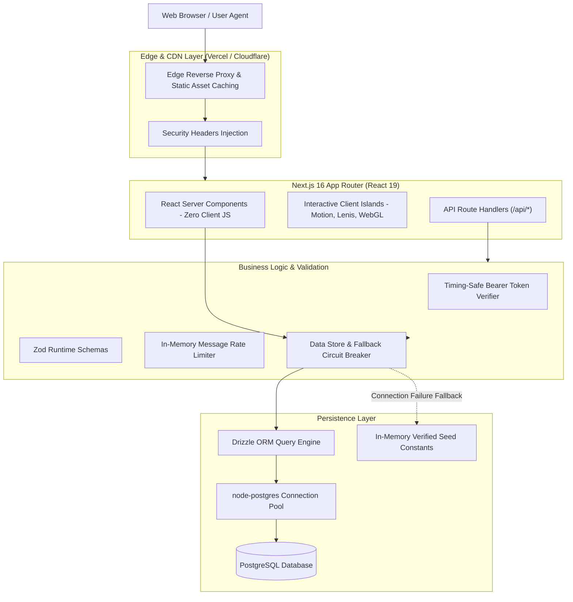

# System Architecture & Technical Specifications

This document outlines the software engineering architecture, design principles, data flow, and security mechanisms implemented in the portfolio web application.

---

## 1. High-Level System Architecture

The application is structured into four distinct layers:



---

## 2. Directory & Component Structure

The repository follows standard Next.js App Router conventions with domain-driven component separation:

```
├── .github/                  # Automation & CI/CD workflows
│   ├── workflows/            # GitHub Actions (CI & CD)
│   ├── ISSUE_TEMPLATE/       # Structured bug and feature templates
│   └── PULL_REQUEST_TEMPLATE # Standard PR checklist
├── docs/                     # Architectural and operational documentation
│   ├── ARCHITECTURE.md       # Technical specification & design patterns
│   └── DEPLOYMENT.md         # Production runbooks and troubleshooting
├── public/                   # Static assets (SVGs, Favicons, WebManifest, PDF)
├── scripts/                  # Operational scripts (seed, setup)
│   └── seed.ts               # Standalone database population script
├── src/
│   ├── app/                  # Next.js 16 App Router
│   │   ├── (routes)/         # /, /about, /contact, /projects, /resume, /studio
│   │   ├── api/              # /api/health, /api/contact, /api/studio, /api/projects
│   │   ├── layout.tsx        # Root HTML wrapper with theme & backdrop providers
│   │   ├── robots.ts         # Automated search engine robots.txt generator
│   │   └── sitemap.ts        # Automated XML sitemap generator
│   ├── components/           # UI components organized by domain
│   │   ├── about/            # Experience, credentials, education, skills
│   │   ├── contact/          # Contact form, cards, call-to-actions
│   │   ├── hero/             # Morphing canvas portrait, headline, introduction
│   │   ├── layout/           # Global navigation, backdrop canvas, smooth scroll
│   │   ├── pipeline/         # Horizontal capabilities rail & tech badges
│   │   ├── projects/         # Featured work grid, case highlights, architecture
│   │   ├── shaders/          # WebGL GLSL shaders for interactive visual depth
│   │   ├── story/            # Approach principles and chronological journey
│   │   ├── studio/           # Live authenticated CMS editor
│   │   └── ui/               # Reusable atomic primitives
│   ├── db/                   # Database engine & schema
│   │   ├── index.ts          # Resilient connection pool & Drizzle ORM client
│   │   └── schema.ts         # Relational schema (projects, profile, messages)
│   ├── lib/                  # Application core utilities
│   │   ├── admin-auth.ts     # Constant-time token authentication
│   │   ├── metadata.ts       # Dynamic OpenGraph, Twitter, and SEO metadata
│   │   ├── portfolio-data.ts # Verified baseline seed data and types
│   │   ├── portfolio-store.ts# Project retrieval engine with sync & fallbacks
│   │   ├── profile-store.ts  # Profile retrieval engine with sync & fallbacks
│   │   └── validation.ts     # Zod schemas for input validation
│   └── types/                # Central TypeScript definitions
│       ├── env.d.ts          # Strongly-typed NodeJS.ProcessEnv
│       └── index.ts          # Domain export barrel
├── Dockerfile                # Production multi-stage container build
├── docker-compose.yml        # Multi-container local/VPS stack (App + Postgres)
├── drizzle.config.ts         # Drizzle Kit migration toolchain configuration
├── next.config.ts            # Production headers, image origins, and standalone config
└── tsconfig.json             # Strict TypeScript compiler options
```

---

## 3. Core Architectural Patterns

### 3.1. Zero-Downtime Data Fallback Pattern (Circuit Breaker)

In standard database-backed applications, a transient network error or cold-start timeout in PostgreSQL results in HTTP 500 crashes for visitors.

This application implements a **Graceful Degradation Pattern**:
1. All database queries in `portfolio-store.ts` and `profile-store.ts` are guarded with try/catch blocks.
2. If PostgreSQL is offline, undergoing schema migration, or unprovisioned during build-time static page pre-rendering, the query engine logs a structured warning and immediately returns the verified, static fallback dataset (`initialProjects` or `defaultProfile`).
3. Visitors never see a broken page.
4. The dedicated health check `/api/health` queries `SELECT 1` and reflects the actual database status (`ok: false`), allowing monitoring agents to alert the team without degrading the visitor experience.

### 3.2. Timing-Safe Authentication Pattern

To protect the `/studio` CMS endpoints against side-channel timing attacks, token verification avoids string equality (`===`) and uses Node.js's native `timingSafeEqual`:

```typescript
const a = Buffer.from(expectedToken);
const b = Buffer.from(suppliedToken);
return a.length === b.length && timingSafeEqual(a, b);
```

### 3.3. Dual-Layer Spam Prevention

The contact form pipeline (`/api/contact`) incorporates:
1. **Honeypot Field (`website`)**: Invisibly presented to screen-scrapers and bots; if filled, the submission is silently dropped with HTTP 201 without touching the database.
2. **Rate Limiting**: Limits submissions to 3 messages per hour per email address to mitigate mailbombing and storage abuse.
3. **Zod Boundary Validation**: Enforces string length bounds (names <= 120 chars, messages <= 3,000 chars) and RFC 5322 email syntax.

---

## 4. Performance & Core Web Vitals

- **Server-First Rendering**: The majority of pages are rendered on the server, eliminating client-side bundle weight for layout structures.
- **Dynamic Imports**: Heavy WebGL shaders and smooth scroll libraries (`lenis`, `ogl`) load dynamically only when client rendering is mounted.
- **Standalone Docker Output**: The Next.js production build produces an isolated bundle in `.next/standalone`, discarding devDependencies and trimming Docker image sizes to under 150MB.
